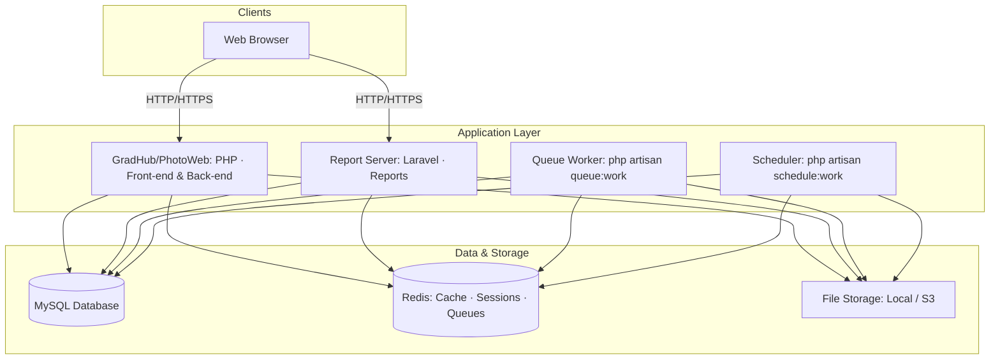
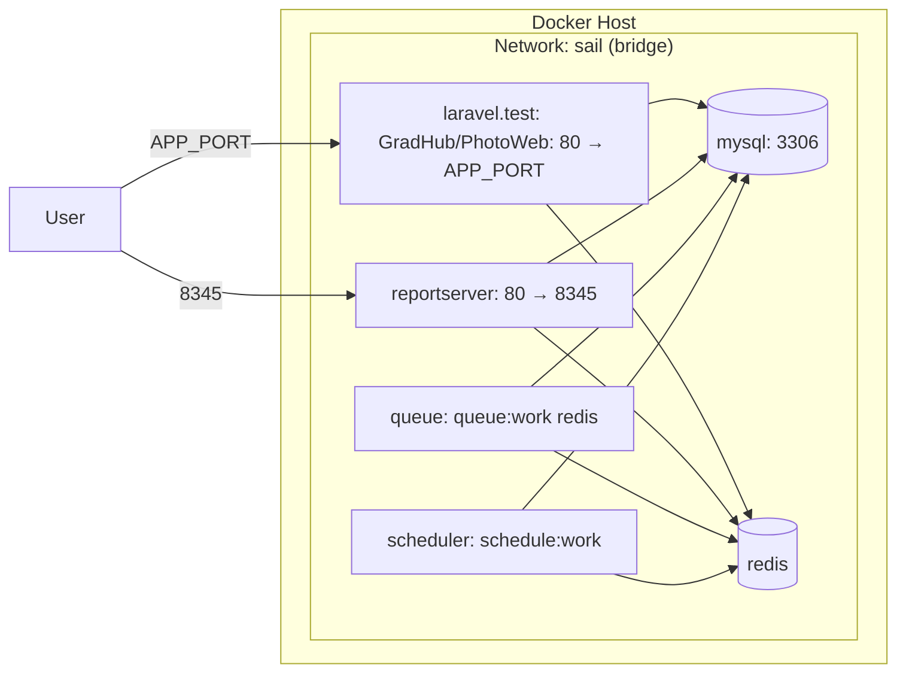
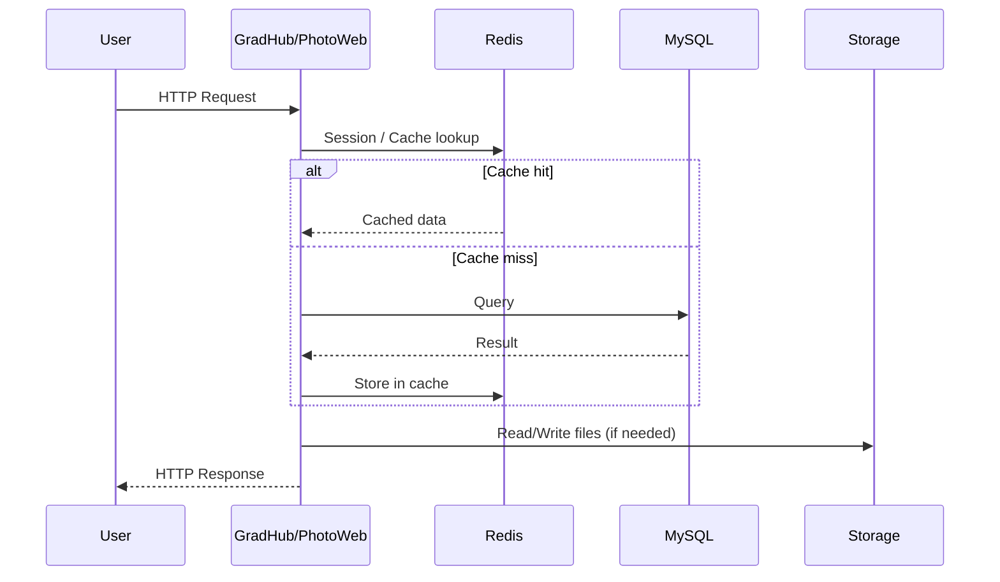
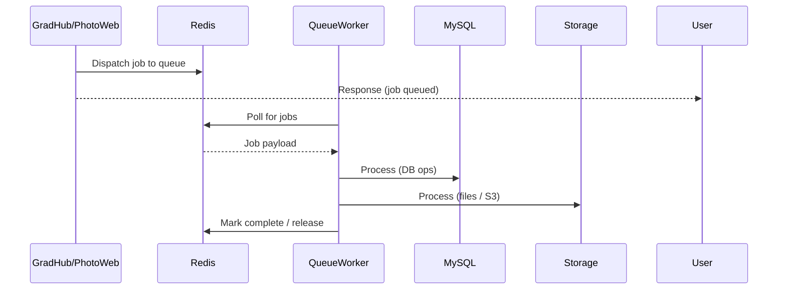
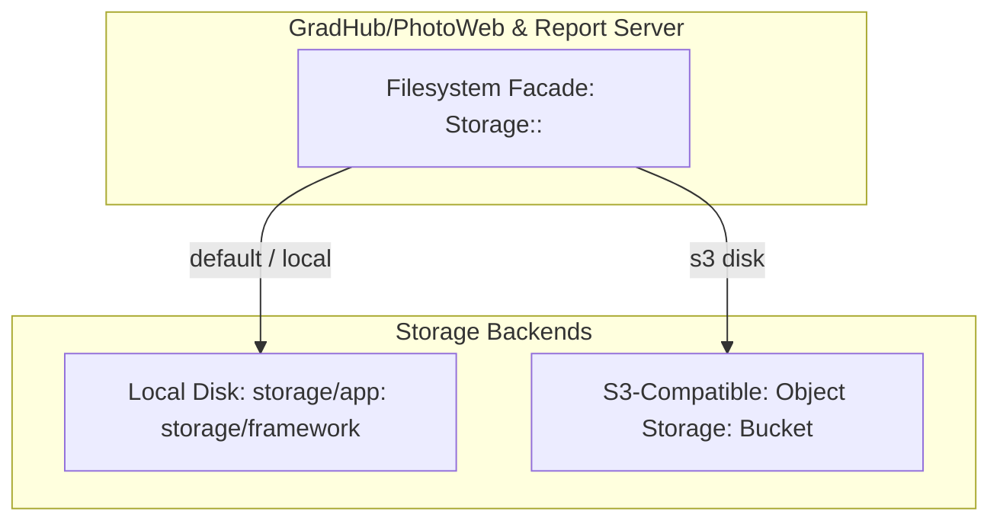
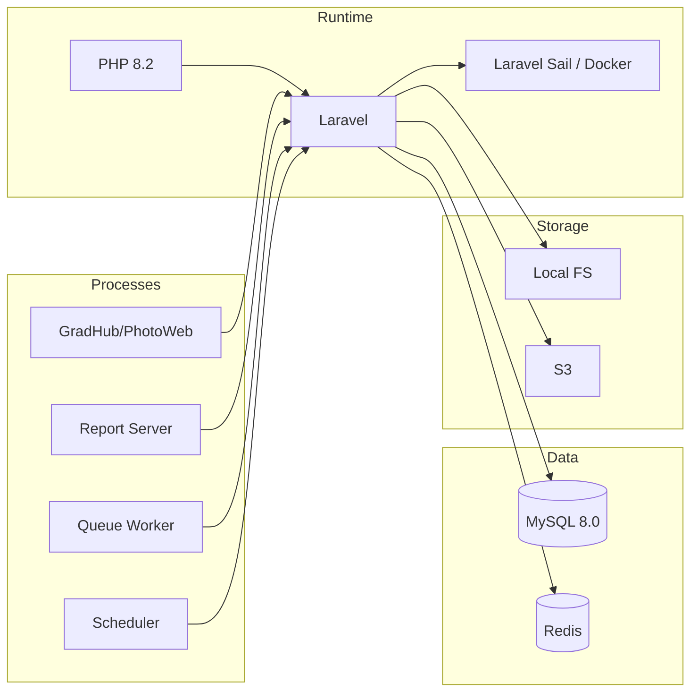

# Solution Architecture — GradHub/PhotoWeb

This document describes the architecture of the GradHub/PhotoWeb solution built with PHP Laravel, including runtime topology, data flows, and deployment model.

---

## 1. High-Level Architecture

---

## 2. Component Overview

| Component | Role |
|-----------|------|
| **GradHub/PhotoWeb** | Main Laravel app: serves web UI, API, and server-side logic. |
| **Report Server** | Laravel-based service for report generation and delivery (e.g. port 8345). |
| **Queue Worker** | Runs `queue:work` to process jobs from Redis queues (async tasks). |
| **Scheduler** | Runs `schedule:work` to execute Laravel scheduled tasks (cron-like). |
| **MySQL** | Primary relational database for application data. |
| **Redis** | Cache, sessions, and queue driver (and optionally broadcast). |
| **File Storage** | Temp, cache, and data files; backend can be local disk or S3. |

---

## 3. Runtime Topology (Docker Compose)

- **laravel.test**: GradHub/PhotoWeb web server (e.g. Nginx/Apache + PHP); exposes app port and optionally Vite dev port.
- **reportserver**: Report Server (Laravel); exposes port 8345 for report generation and delivery.
- **queue**: Same app image as GradHub/PhotoWeb, entrypoint `php artisan queue:work redis`; processes jobs from Redis.
- **scheduler**: Same app image, entrypoint `php artisan schedule:work`; runs cron-like tasks.
- **mysql**: MySQL 8.0; port forwarded to host (e.g. 3309); persistent volume for data.
- **redis**: Redis; used by app, report server, queue, and scheduler (no port exposed unless configured).

---

## 4. Data Flow

### 4.1 Web Request Flow

### 4.2 Asynchronous Job Flow

### 4.3 Scheduled Task Flow

---

## 5. Storage Architecture

- **Local**: Temp files, cache, and app-generated files under `storage/` (and optionally public uploads).
- **S3**: Same API via Laravel filesystem; used for persistent or shared assets (e.g. uploads, exports, backups).
- Configuration is environment-driven (e.g. `FILESYSTEM_DISK`, `AWS_*`); same code can use local in dev and S3 in production.

---

## 6. Technology Stack Summary

---

## 7. Deployment Context (Docker Compose)

- **Images**: GradHub/PhotoWeb and Report Server use PHP 8.2 Sail-based images; MySQL and Redis use official images.
- **Volumes**: App code mounted into `laravel.test`, `reportserver`, `queue`, and `scheduler`; MySQL data in a dedicated volume.
- **Dependencies**: `laravel.test`, `queue`, and `scheduler` depend on `mysql` and `redis`; queue and scheduler start after DB/Redis are available. `reportserver` has no `depends_on` in compose (configure as needed).
- **Scaling**: Multiple `queue` replicas can be added for higher throughput; single `scheduler` is typically sufficient.

---

## 8. Document Info

- **Format**: Markdown with Mermaid diagrams in fenced blocks. Use **Markdown preview** (with Mermaid support) on this `.md` file to see both text and diagrams.
- **mermaid.live**: Paste **only** the diagram code there (no markdown). Copy the contents of one mermaid block above—from the first line like `flowchart TB` or `sequenceDiagram` to the last line of that block—and paste into mermaid.live. Do not paste the whole page or any lines starting with `#`.
- **Scope**: Architecture only; no code. Implementation details (routes, env vars, exact ports) follow from project configuration and this layout.
